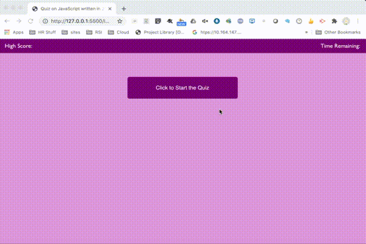

# Introduction
The assignment for homework2 is to create a web application tha utilizes the bootstrap 4 stylesheets to create responsive design ensures that web applications render well on a variety of devices and window or screen sizes.

## Table of contents
* [General info](#general-info)
* [Technologies](#technologies)
* [Setup](#setup)
* [User Guide](#user-guide)
* [Credits](#credits)

## General info
This object of this assignment is to generate a javascript quiz that stores high scores
so that the user can gauge progress compared to peers.

	
## Technologies
Project is created with:
* Bootstrap version: 4.4.1
* Node JS version: v12.18.4
	
## Setup
To run this project, install is a simple download and extraction of the site and access to the internet is required 
the code relies on bootstrap style sheet and assoicated java scripts.

## User Guide
Behavior to meet requirements:

User click the start button to start a timer starts and  user presented with a question after answer selected.

User is presented with another question if answered a question incorrectly 5 seconds is subtracted from the clock
When all questions are answered or the timer reaches the game is over if you are a high scorer you can save my initials and score.

The application

## credits
Much of the code used in this project was copied from the bootstrap 4 samples and W3C 
sample documents. Adjustments were made to make the code work.

Peer review by study group: Lucah, Clarence and Jeff

Code Validated by https://validator.w3.org/

